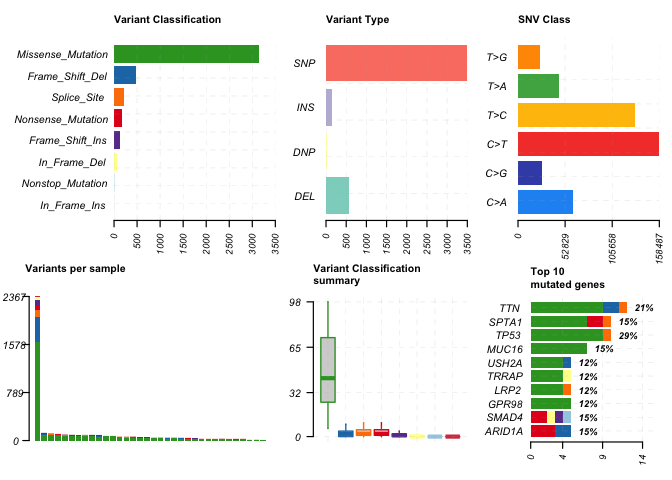

<!-- README.md is generated from README.Rmd. Please edit that file -->

# PCAWGmutations

<!-- badges: start -->

[](https://lifecycle.r-lib.org/articles/stages.html#experimental)
[](https://CRAN.R-project.org/package=PCAWGmutations)
[](https://app.codecov.io/gh/CCICB/PCAWGmutations?branch=main)
[](https://github.com/CCICB/PCAWGmutations/actions/workflows/R-CMD-check.yaml)
<!-- badges: end -->

R package for loading PCAWG data into R as MAF objects.

> **Note** data is streamed from the
> [**CCICB/PCAWGmutationsDB**](https://github.com/CCICB/PCAWGmutationsDB)
> repo

## Installation

You can install the development version of PCAWGmutations like so:

``` r
# install.packages("remotes")
remotes::install_github("CCICB/PCAWGmutations")
```

## Usage

### List available datasets

``` r
library(PCAWGmutations)

pcawg_available()
#>        Abbreviation                             Full name Samples
#> 1   Biliary-AdenoCA                Biliary Adenocarcinoma      34
#> 2         Bone-Cart          Bone, Cartilaginous neoplasm       9
#> 3        Bone-Epith            Bone neoplasm, epithelioid      11
#> 4    Bone-Osteosarc                    Bone, Osteosarcoma      44
#> 5    Breast-AdenoCa                Breast, Adenocarcinoma     113
#> 6       Breast-DCIS Breast, Duct micropapillary carcinoma       3
#> 7  Breast-LobularCa             Breast, Lobular carcinoma       7
#> 8       CNS-Medullo                  CNS, Medulloblastoma     146
#> 9     CNS-PiloAstro            CNS, Pilocytic astrocytoma      89
#> 10      Eso-AdenoCa             Esophagus, Adenocarcinoma      98
#> 11         Head-SCC     Head/Neck Squamous cell carcinoma      13
#> 12       Kidney-RCC           Kidney Renal cell carcinoma      74
#> 13        Liver-HCC              Hepatocellular carcinoma     273
#> 14       Lymph-BNHL                Mature B-cell lymphoma      98
#> 15        Lymph-CLL          Chronic lymphocytic leukemia      95
#> 16        Lymph-NOS     Lymphoma, Not Otherwise Specified       2
#> 17      Myeloid-AML                Acute myeloid leukemia      16
#> 18      Myeloid-MDS              Myelodysplastic syndrome       3
#> 19      Myeloid-MPN              Myelodysplastic syndrome      51
#> 20    Ovary-AdenoCA                 Ovary, Adenocarcinoma      71
#> 21     Panc-AdenoCA              Pancreas, Adenocarcinoma     241
#> 22   Panc-Endocrine        Pancreas, Neuroendocrine tumor      85
#> 23    Prost-AdenoCA              Prostate, Adenocarcinoma     267
#> 24    Skin-Melanoma                              Melanoma      70
#> 25  Stomach-AdenoCA               Stomach, Adenocarcinoma      37
#>                                          DOI
#> 1  https://doi.org/10.1038/s41586-020-1969-6
#> 2  https://doi.org/10.1038/s41586-020-1969-6
#> 3  https://doi.org/10.1038/s41586-020-1969-6
#> 4  https://doi.org/10.1038/s41586-020-1969-6
#> 5  https://doi.org/10.1038/s41586-020-1969-6
#> 6  https://doi.org/10.1038/s41586-020-1969-6
#> 7  https://doi.org/10.1038/s41586-020-1969-6
#> 8  https://doi.org/10.1038/s41586-020-1969-6
#> 9  https://doi.org/10.1038/s41586-020-1969-6
#> 10 https://doi.org/10.1038/s41586-020-1969-6
#> 11 https://doi.org/10.1038/s41586-020-1969-6
#> 12 https://doi.org/10.1038/s41586-020-1969-6
#> 13 https://doi.org/10.1038/s41586-020-1969-6
#> 14 https://doi.org/10.1038/s41586-020-1969-6
#> 15 https://doi.org/10.1038/s41586-020-1969-6
#> 16 https://doi.org/10.1038/s41586-020-1969-6
#> 17 https://doi.org/10.1038/s41586-020-1969-6
#> 18 https://doi.org/10.1038/s41586-020-1969-6
#> 19 https://doi.org/10.1038/s41586-020-1969-6
#> 20 https://doi.org/10.1038/s41586-020-1969-6
#> 21 https://doi.org/10.1038/s41586-020-1969-6
#> 22 https://doi.org/10.1038/s41586-020-1969-6
#> 23 https://doi.org/10.1038/s41586-020-1969-6
#> 24 https://doi.org/10.1038/s41586-020-1969-6
#> 25 https://doi.org/10.1038/s41586-020-1969-6
```

### Load datasets

``` r
library(PCAWGmutations)
library(maftools)

maf = pcawg_load("Biliary-AdenoCA")
#> Loading PCAWG data [Biliary-AdenoCA]
#> If you find this data useful, please cite https://doi.org/10.1038/s41586-020-1969-6
#>                    ID summary    Mean Median
#>  1:        NCBI_Build      NA      NA     NA
#>  2:            Center      NA      NA     NA
#>  3:           Samples      34      NA     NA
#>  4:            nGenes    3388      NA     NA
#>  5:   Frame_Shift_Del     486  14.294    2.0
#>  6:   Frame_Shift_Ins     134   3.941    1.0
#>  7:      In_Frame_Del      63   1.853    0.0
#>  8:      In_Frame_Ins       1   0.029    0.0
#>  9: Missense_Mutation    3139  92.324   42.5
#> 10: Nonsense_Mutation     170   5.000    2.0
#> 11:  Nonstop_Mutation       7   0.206    0.0
#> 12:       Splice_Site     215   6.324    2.0
#> 13:             total    4215 123.971   50.0
plotmafSummary(maf)
```



## Data preprocessing

[Preparing PCAWG
data](https://github.com/CCICB/PCAWGmutationsDB/blob/main/inst/markdowns/prep_PCAWG_mafs.Rmd)
